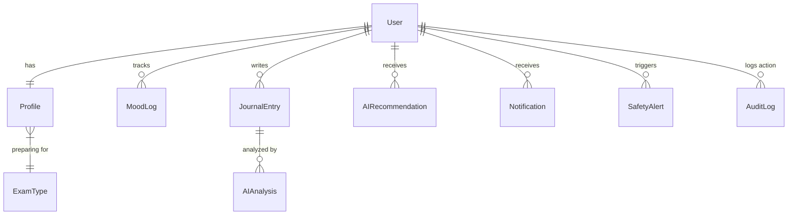

# Database Design: AuraWell

AuraWell uses PostgreSQL for production and SQLite for local development.

## Relationships Diagram

## Schema Details

### 1. `ExamType`
Stores standard high-stakes exams.
* `id` (PK)
* `name` (unique CharField)
* `description` (TextField)

### 2. `Profile`
Student profile linking User to an `ExamType`.
* `id` (PK)
* `user` (OneToOneField to User)
* `exam_type` (ForeignKey to ExamType, ON_DELETE=SET_NULL)

### 3. `MoodLog`
Daily parameters logged by user.
* `id` (PK)
* `user` (ForeignKey to User)
* `mood_score` (IntegerField, 1-5)
* `stress_score` (IntegerField, 1-5)
* `energy_level` (IntegerField, 1-5)
* `sleep_quality` (IntegerField, 1-5)
* `study_satisfaction` (IntegerField, 1-5)
* `logged_date` (DateField)
* Unique Constraint: `(user_id, logged_date)`

### 4. `JournalEntry`
Secure text entries of daily reflections.
* `id` (PK)
* `user` (ForeignKey to User)
* `content` (TextField)

### 5. `AIAnalysis`
Empathetic emotion analysis reports.
* `id` (PK)
* `journal_entry` (OneToOneField to JournalEntry)
* `primary_emotion` (CharField)
* `stress_indicators` (JSONField)
* `burnout_risk` (CharField, LOW/MEDIUM/HIGH)
* `motivation_trends` (JSONField)
* `summary` (TextField)

## Indexing Strategy
* **`MoodLog(user_id, logged_date)`**: Primary indexing for rendering line charts and daily checks.
* **`JournalEntry(user_id, created_at)`**: Sorting and retrieval optimizations.
* **`SafetyAlert(user_id, resolved)`**: Filtering outstanding crisis alerts.
